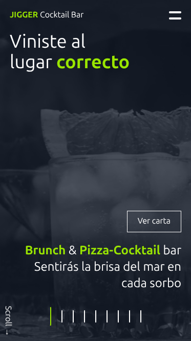

# Maquetación Vanilla JS Full SPA

Creando una landing page mobile first que realiza toda la navegación mediante animaciones con transiciones y timemouts de JS.

Está pendiente de agregar contenido, unificar el diseño, optimizar recursos, etc.

[Aquí](https://jigger-web.web.app/) se puede ver er resultado.

---------------

## ToDos;
1. Mejorar responsive movil horizontal
2. Mejorar responsive otros dispositivos
5. Agregar contenido
6. Agregar secciones a la URL y navegacion directa hacia secciones.

--------------

## Log

### 2025-07-16
Agregando Scroll horizontal, optimizando media y agregado favicon.
Se ha quitado algunas cosas que bloqueaban el TCL para mejorar rendimiento.
Se han agregado metadatos y cosas extras.

### 2025-07-15
Primera versión responsive de la web funcional.